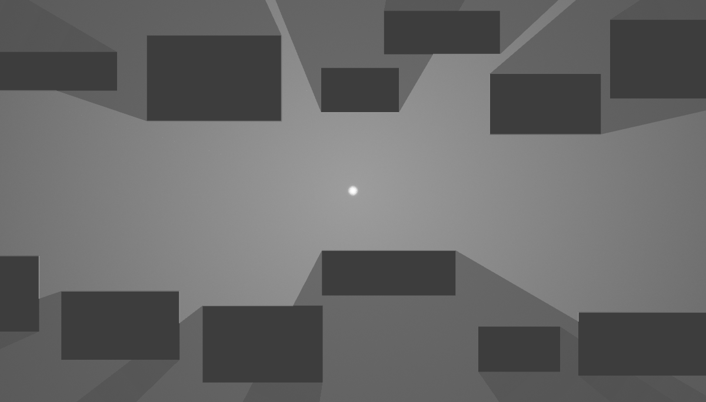
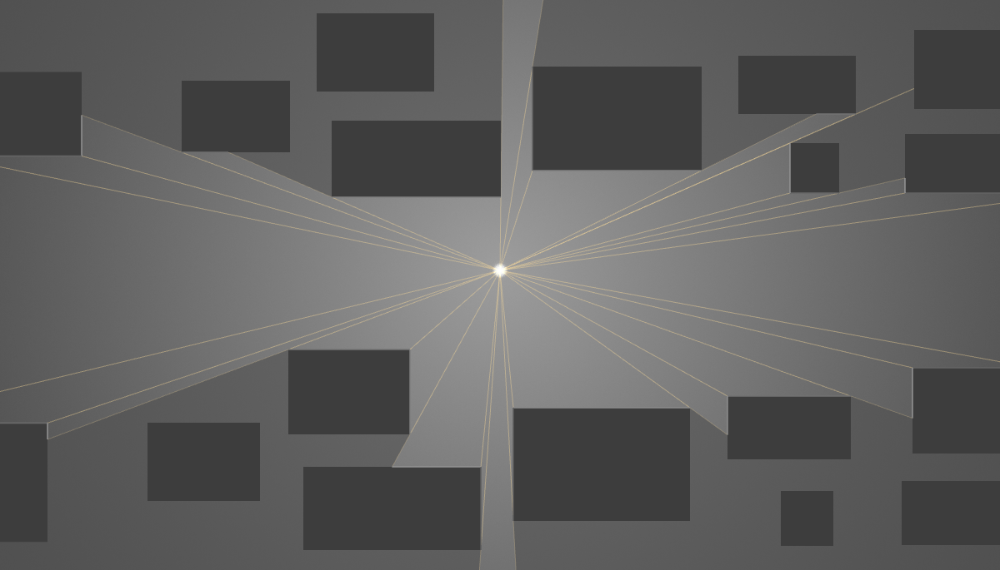
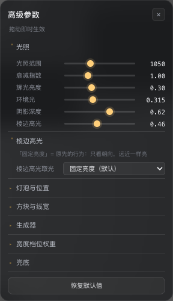

# 2D 光线追踪 Demo · 精确边缘锁定

> 本项目由 **DeepSeek V4.1 Flash (Max)** 生成。

一个 2D 点光源硬阴影 Demo：方块程序化生成、自左向右平移。阴影边界由**角点角度精确锁定** —— 每个角区间只投 1 条射线问出遮挡者，再把区间两端精确钉在角点上，而不是均匀扫 360 条。

**为什么能这样**：可见多边形的顶点只可能落在「光源 → 角点」这些射线上，而相邻两个角点角度之间，最近的遮挡者身份不会变。所以射线数由角点数决定、与 360 无关；边界严格沿「光源 → 角点」走，0 误差、也不需要 ε。



<sub>截图对应的世界：`#seed=20260910`（首次打开会随机挑一颗种子，所以每个人看到的都不一样）</sub>

**不想装环境就直接看在线版**：<https://cht-1192.github.io/2D-Ray-Trace-Demo/>

`npm test` 用一套独立实现（极密角度扫描求可见面积）当裁判，实测：

| 算法 | 每帧射线数 | 可见面积相对误差 |
| --- | --- | --- |
| **exact（本 Demo 默认）** | **52**（= 角点数，随场景变化） | **0.0002 %** |
| edge（每个角点 ±ε 各一条） | 156 | 0.0614 % |
| uniform（均匀扫 360 条） | 360 | 1.0460 % |

打开「调试射线」就能直接看到结论：每条射线都正好终止在方块角点上，一根多余的都没有。



## 快速开始

```bash
npm install
npm start                 # http://127.0.0.1:6850
```

- `npm start` —— 构建 + 起静态服务器（**零依赖** Node http 服务，`server/server.mjs`）
- `npm run dev` —— 监听 `src/`、`public/`，改动自动重建 + 页面自动刷新
- `npm run build` —— 产出 `dist/`（站点）与 `dist/standalone.html`（**单文件版**）
- `npm test` —— 几何 / 可见性 / 生成器自检（Node 里跑，61 项）
- `npm run verify` —— Playwright + Chromium 端到端验证（79 项，见下文）
- `npm run typecheck` —— `tsc --noEmit`

**单文件版**：直接双击 `dist/standalone.html`（CSS/JS 全部内联，`file://` 可用，无需服务器与构建）。
它是交付物，所以跟源码一起提交进了仓库；其余构建产物不入库，`npm run build` 可随时重新生成。

## 部署（GitHub Pages）

线上地址 <https://cht-1192.github.io/2D-Ray-Trace-Demo/>，**每次推送到 `main` 自动重新构建发布**：

`.github/workflows/pages.yml` 只做三步 —— `npm ci` → `npm run build` → `npm run typecheck`，然后把 `dist/` 交给官方 Pages Actions 发布。没有为 CI 另写一套构建逻辑，本地 `npm run build` 与线上产物同源；`public/index.html` 里的资源都是相对路径，部署到子目录不需要任何 base 配置。发布前会补两个文件：`.nojekyll`（关掉 Jekyll 处理；Pages 的 CDN 不提供点文件，所以直接访问 `/.nojekyll` 会 404，属正常）与 `404.html`（地址敲错时兜底回 Demo）。

仓库的 Pages 构建源设成了 **GitHub Actions**（不是分支），所以 `gh-pages` 分支不存在也不需要；只要 Actions 是启用状态，推送即上线，进度在仓库的 Actions 标签页可见。

**在线版**：<https://cht-1192.github.io/2D-Ray-Trace-Demo/>。GitHub Actions（`.github/workflows/pages.yml`）在每次推送到 `main` 时跑 `npm ci` → `npm run build` → `npm run typecheck`，把 `dist/` 发布到 Pages；本地与 CI 共用同一份构建脚本，产物一致。资源全是相对路径，所以子目录部署不需要额外配置。

## 操作

| 键 | 作用 | 键 | 作用 |
| --- | --- | --- | --- |
| `1` / `2` / `3` | 切换 exact / edge±ε / uniform 算法 | `R` | 显示调试射线 |
| `Space` | 暂停 | `M` | 光源跟随鼠标（光标进方块会提示"光源被挡住"） |
| `←` / `→` | 速度 ∓10 | `B` | 显示/隐藏方块（看可见多边形本体） |
| `N` | 换一个随机种子 | `A` | 高级参数面板 |
| `H` | 隐藏面板 | `Esc` | 关闭高级面板 |
| 种子框 | 输入数字回车 = 用该种子重建 | `随机` | 换一个随机种子 |

## 方块是怎么生成的

世界完全由种子生成：**在屏幕左侧之外采样尺寸与位置、随相机推进进入视野、滚出右侧后被回收**。它是一条不断向远处延伸的条带（相机向左走），不是一张固定图样在环绕，所以不会出现重复布局。

尺寸不是查表，而是从参考图那 16 个方块**拟合出来的分布**里采样（`src/core/layout.ts`）：

- **宽度三档**：实测直方图是 59~63(2 个) / 130~148(8 个) / 203~215(6 个)，而 80~120 与 160~200 完全是空的 —— 原图就是「小方块 / 中条 / 长条」三档，权重 2:8:6。生成时保留三档与权重，但每档宽度**连续随机**并左右放宽（50~86 / 116~164 / 188~230），因此合计有 **129 种可能宽度**（参考图只有 13 种）。
- **长宽比**：实测 ≈ LogNormal(μ=0.510, σ=0.304)（中位数 1.66，跨度 0.95~2.92），用 Box–Muller 采样；算出的高度若越界就重采，避免所有极端宽度被夹到同一高度。
- **高度**：46~150（实测 60~136 两端各放宽一点）。

位置由**放置带**决定：把参考图的 16 个方块按 y 聚类，在最大的垂直空隙处切开，得到上下两条带（`y∈[10,243]` 与 `[414,667]`，由数据推导而非写死）。带间 y 不重叠 ⇒ 跨带永不碰撞；带内则在随机 y 上做碰撞检测（14 次随机 + 32 格细扫），挤不下就往前挪。

**硬约束：任意时刻方块两两不重叠。** 这既是画面整洁的需要，更是可见性算法「一个角区间内遮挡者唯一」的前提 —— `npm test` 会跑 90 秒（5400 步）逐步校验这一点。

生成 / 回收都发生在屏幕外（`SPAWN_MARGIN=280`、`CULL_MARGIN=120` 参考单位）：灯泡在画面正中，左侧方块投出的阴影只会更靠左，所以完全在屏幕外的方块不可能影响画面，可以安全剔除、也不会出现「凭空冒出来」的跳变。

## 可复现性

打开页面时若地址栏没有 `#seed=`，会**随机挑一颗种子**并立刻写回地址栏 —— 所以每个访客看到的世界都不一样，
而刷新或把链接发给别人又能拿到同一个。世界完全由种子决定，而且**与帧率无关**。关键在 `src/core/scene.ts` 里：`mixSeed(seed, bandIndex)` 给每条放置带派生一条**独立**的随机数流。

如果两条带共用一条流，「这条带这一帧要生成几个方块」就会消费掉对方的随机数 —— 而这件事取决于帧间隔，同种子在不同帧率下就会长出不同的世界。独立成流之后，方块序列只与**滚动距离**一一对应：

- 首次加载随机挑种子（两次全新打开必然不同），随即写入地址栏，刷新后逐位一致；
- 同一个种子生成两次，方块列表逐位一致；
- 30fps / 60fps / 240fps 跑过相同距离，生成的方块完全相同（`npm test` 实测 `55 = 55 = 55`，集合逐项相等）；
- 种子写进地址栏 `#seed=…`，刷新或把链接发给别人都能复现同一个世界。

面板上的「种子」可以直接改：输入新数字回车即重建，`随机` 按钮换一颗种子（`N` 键同效）。生成时用 `Math.random` 只是挑种子，世界的生成本身是可复现的纯函数。

## 算法：为什么 360 条射线是浪费

**核心观察**：可见多边形的顶点只可能出现在「光源 → 障碍物角点」这些射线上。相邻两个角点极角之间，最近的遮挡线段的**身份不会变**，于是在区间内部随便取一条射线就能问出「这一段被谁挡着」。

于是：

1. 收集所有线段端点的极角 → 排序去重，得到 m 个临界角；
2. 每个角区间取**中点**投一条射线，问出该区间唯一的遮挡线段（共 m 条射线，与 360 无关）；
3. 把区间两端**精确钉**回这条线段（参数 `u` 夹到 `[0,1]`）——区间端点本身就是角点，夹取之后交点必定落在角点上，阴影边界因此严格沿「光源→角点」射线走，既不漏光也不需要 ε。

连续命中同一条线段的采样会被合并成一个「可见段」（同一条线段上极角单调 ⇒ `u` 单调，中间点必然共线），所以顶点数也和角点数同阶：默认世界下 52 条线段 → 52 条射线 → 38 个顶点（场景变大时同比例增长，始终与 360 无关）。

另外两条实现路径作为对照：

- `edge`：每个角点 ±ε 各投一条（工程上最常见的近似），阴影边界会随 ε 出现细微漏光；
- `uniform`：固定 N 条均匀扫一圈，边界落在随机角度上，方块一移动阴影边缘就抖。

三种模式共用同一套扇形三角化与渲染路径，切一下就能看出差别。

**为什么可以「一个区间只问一次」**：两条不相交线段对同一光源的距离函数不可能在某个角度相交，所以区间内最近遮挡者的身份恒定。方块互不重叠这一条由生成器的碰撞检测保证，并由测试持续校验。

## 项目结构

```
2D-Ray-Trace-Demo/
├── src/
│   ├── app.ts                  主循环：滚动 → 求可见性 → 渲染 → HUD
│   ├── config.ts               全部可调参数（配色/衰减/模式默认值）
│   ├── core/                   与渲染无关的纯几何（Node 里可直接测）
│   │   ├── math.ts             标量/角度工具 + 种子派生 + 可复现随机数
│   │   ├── segment.ts          线段 + 射线求交 + pinToSegment（精确钉边）
│   │   ├── layout.ts           参考图数据、尺寸分布拟合、放置带、采样器
│   │   ├── scene.ts            滚动条带 / 种子化生成 / 线段池 / 遮挡判定
│   │   └── visibility.ts       ★ 三种可见性算法（exact / edge / uniform）
│   ├── render/
│   │   ├── types.ts            RenderModel / Renderer 接口
│   │   ├── mesh.ts             三角形缓冲组装（线用四边形拼，绕开 lineWidth 限制）
│   │   ├── rim.ts              ★ 棱边高光：亮段收集 + 四种取光方式的亮度模型（两后端共用）
│   │   ├── shaders.ts          GLSL ES 3.00
│   │   ├── webgl-renderer.ts   WebGL2 后端（3 次 draw）
│   │   ├── canvas2d-renderer.ts Canvas 2D 回退（同一套几何，观感一致）
│   │   └── index.ts            后端工厂：优先 WebGL2，失败自动换 canvas 回退
│   └── ui/
│       ├── hud.ts              控制面板（纯 DOM 覆盖层）
│       └── input.ts            键盘 / 指针
├── .github/workflows/pages.yml 推送 main 自动构建并发布到 GitHub Pages
├── server/server.mjs           零依赖静态服务器（缺 dist 会自动构建）
├── scripts/
│   ├── build.mjs               esbuild 打包 + 单文件版内联 + watch
│   ├── test.mjs                跑 test/（esbuild 打包成临时 ESM 再执行）
│   └── verify.mjs              Playwright + Chromium 端到端验证
├── test/                       算法与生成器自检
├── public/                     页面与样式（构建时 inline 进单文件版）
└── dist/                       构建产物（app.js / index.html / standalone.html）
```

技术栈：**TypeScript**（`strict`，浏览器侧无运行时依赖）→ esbuild 打成 IIFE；**Node** 只做服务器与构建；渲染 **WebGL2**（默认）或 **Canvas 2D**（回退）。

## 渲染管线

坐标系统：世界高度恒为 685（对齐参考图），宽度按视口宽高比推导，因此任何窗口尺寸下构图一致；仿真本身跑在参考坐标系 (1200×685) 里，可见宽度恒为一个参考屏宽，只有渲染时才乘上缩放。

每帧五个阶段：

1. **本影计数趟**（离屏）—— 每个方块画一个「本影四边形」到离屏纹理，叠加混合，于是每个像素记下**被几个方块挡住**（多重阴影用）；
2. **背景层** —— 全屏辉光，参数取「一个遮挡物之后」的亮度：`bgFar + glowAmp·ds·(1-d/R)^p`（`ds = 1-directShare`），带抖动消色带；
3. **直接光层** —— 可见多边形以光源为中心扇形三角化（多边形关于光源是星形，无需耳切），叠加混合，像素级按距离衰减；阴影区拿不到这一层，硬阴影就是这么来的；
4. **多重阴影修正** —— 按第 1 步的计数，把被 n≥2 个方块挡住的区域再压暗成 `bgFar + amp·f·dsⁿ`；
5. **叠加层** —— 方块本体、被照亮的棱边、调试射线、灯泡；线宽用四边形拼（`lineWidth` 在多数实现里恒为 1）。

**多重阴影**（重叠的阴影会继续变暗）用的还是同一条几何原则：方块是凸的，从光源看过去只有两个**剪影角点**（恰好只有一条相邻边朝向光源的角点），两条剪影射线围出的区域就是它的本影 —— 同样不需要 ε。每个遮挡物把辉光乘一次 `ds`，所以 n 个遮挡物就是 `dsⁿ`：n=0 是亮区，n=1 正好等于原来的阴影（**观感不变**），只有重叠区继续变暗。参考布局下约 32% 的画面有 ≥2 个遮挡物。

修正这一步有个坑：OpenGL ES 对定点（RGBA8）帧缓冲会**在混合前把源色钳到 [0,1]**，所以不能输出负值去减。改成等价的乘法式衰减 `dst ← dst·(1 - src)`，其中 `src = 要减掉的量 / 当前值`，两者着色器都能自己算出来。

「被照亮的棱边」直接来自可见性结果的副产品：每条线段被照亮的参数区间 `[u0,u1]`，再乘以该边外法线与光源方向的夹角 —— 所以方块迎光那条棱的亮段与阴影边界严格对齐。

**棱边高光用哪里的亮度**是个可以直接改的选项（高级面板「棱边高光 → 棱边高光取光」，默认**固定亮度**）：

| 取光 | 亮度因子 | 观感 |
| --- | --- | --- |
| **固定亮度**（默认） | `1` | 只看朝向，远近一样亮 —— 就是原先的行为 |
| 按辉光衰减 | `f(d)` | 只带距离衰减：近处亮、远处淡 |
| 只取直接光 | `directShare·f(d)` | 只有会被遮挡的那一份；远处 `f→0`，棱边随之消失 |
| 取该处完整亮度 | `(1-directShare) + directShare·f(d)` | 完整复刻地板亮度曲线；最远处仍保留环境光那 38%，不会全灭 |

`f(d) = (1 - d/R)^p`，与背景层、直接光层用的是同一个 `glowRadius` / `glowPower`。

有个约束绕不开：棱边画在**不透明的方块本体**之上，所以它不可能等于「该处地板亮度」本身 ——
那会和方块内部一样黑，棱边就没了。能做的只有把方块底色往白里推，推多少表示「这块表面被照到会有多亮」，
所以四种模式的差别只在**这个比例乘不乘衰减**。`npm run verify` 第 14 节逐点核对过：
模型算出的棱边颜色与画面像素逐位吻合（远近两种距离、四档各一个采样窗口，最大偏差 0/255）。

**Canvas 2D 回退**走的是等价但更省事的路子：离屏画一张「只有 `amp·f` 的光场」，让每个方块的
本影用 `multiply` 依次乘掉 `ds`，最后在主画布上「`bgFar` 地板 + 光场叠加」——
数学上和 WebGL 版的「背景 + 扇形 + 修正」完全等价。实测两版画面平均差 0.39/255。棱边高光两个后端共用同一份
`collectRimSegments`（`src/render/rim.ts`），所以取光模式在两版里也一致。

## 验证

```bash
npm test            # 61 项：算法 + 生成器 + 可复现性 + 棱边高光模型（Node，无需浏览器）
npm run verify      # 79 项：Playwright + Chromium 端到端
```

`npm test`：

- **可见性**：所有可见角点都以 0 误差出现在多边形里；100% 的多边形顶点极角 = 某个角点的极角（uniform 模式 0% 命中）；与「40 万条极密角度扫描」这个独立实现的面积对比（见开头表格）。
- **尺寸分布**：2 万个样本的宽度分位数、长宽比中位数、三档权重都与参考图实测吻合；129 种宽度取值、71.5% 的样本不是参考图里的尺寸。
- **生成器**：90 秒 / 5400 步逐步校验**方块两两不重叠**（0 次）、不越出画面高度、数量有界（峰值 25 个）、持续生成（150 个新方块）、新方块出现时都在屏幕左侧之外（150/150）、可见面积无跳变。
- **可复现性**：同种子两次生成逐位一致；切到别的种子再切回来仍然一致；30/60/240fps 跑过相同距离生成的方块集合完全相同；5 个种子给出 5 个不同世界。
- **不再复刻参考图**：默认种子下，没有任何一个方块的坐标与尺寸与参考图那 16 个重合。

`npm run verify`（Playwright + Chromium，默认用 `/Applications/Chromium.app`，可用 `CHROMIUM_PATH` 指定；目标 URL 不可达时会自动起一个临时服务器）：

- 后端确实是 WebGL2（实测 `ANGLE Metal Renderer: Apple M5`），无 console 报错；
- **首帧是程序化生成**：方块尺寸都落在拟合区间内，灯泡所在横带空着，且与参考图那 16 个方块无一重合；
- **同种子两次生成，截图逐像素完全一致**（平均差 0）；换种子则有 28.8% 像素不同；
- **同一个带 `#seed=777` 的链接打开两次，画面逐像素一致** —— 分享链接就能复现；
- 像素级配色：方块填充 `0x3D3D3D`、远处角落符合环境光模型、亮区衰减与配置模型误差 ≤ 0.5/255、灯泡径向剖面误差 ≤ 9/255；
- **光照范围**：亮光要铺得到画面最远的角（d≈682 处辉光仍有 35%，而不是参考图那套的 1.4%）；
- **高级面板**：按 `A` 能开合、26 个滑块 + 1 个下拉在线；拖「光照范围」整图变亮、拖「阴影深度」整图均值下降、
  「恢复默认值」后画面与改动前**逐像素一致**；
- **棱边高光取光**：四档逐一核对像素 —— 用「朝向因子相同、距离差 3 倍以上」的一近一远两段棱边作对照，
  画面像素与按几何独立复算出的颜色逐位吻合（含「只取直接光」档在远处把棱边压到与方块底色相同）；
  棱边实际画在棱上（离散化后偏差 ≤ 3px）；
- **多重阴影**：约 32% 的画面被 ≥2 个方块挡住；逐点核对亮度符合 `bgFar + amp·f·dsⁿ` 模型
  （n=0/1/2 三个采样点最大误差 0.8/255）；把「阴影深度」调到 0 后阴影不再累积；
- **光源跟随鼠标 + 光标进入方块**：判定为遮挡、HUD 给出提示、灯泡画在光标位置（偏差 1.4px）、
  在方块内部移动光标画面仍更新、移出后恢复照明；
- 硬阴影：半径 150 的圆环上同时存在亮区与阴影区，亮度差 > 25（实测 145 vs 61）；
- 三种算法渲染结果确实不同（exact 与 edge 的差异远小于与 uniform 的差异）；
- **真实时间下 1 秒后每个方块都向右平移了 速度×时间**（12/12 命中）；
- **程序化生成**：快进 90 秒期间出现过 90 种不同宽度（参考图 13 种），画面上确实出现参考图里没有的尺寸，布局与首帧差异 37% 像素；
- `file://` 打开单文件版可用、无报错、画面与站点版逐像素一致；
- 禁用 WebGL 后自动回退 Canvas 2D，画面依然正确。

## 参数速查表

参数基本都做进了界面，不用翻代码：

- **主面板**：算法、速度、射线数、ε、种子，以及四个开关
- **高级面板**（`A` 键，或主面板底部的「高级参数」按钮）：**26 个实时参数 + 1 个下拉选项**，分七组



拖动即时生效：视觉类参数（光照、灯泡、方块灰度、线宽）当帧就能看到；
生成类参数（重叠程度、疏密、宽度缩放、档位权重…）只影响**之后新生成**的方块 ——
想立刻看到效果就按 `N` 换一颗种子。面板底部有「恢复默认值」一键还原。

窄屏（≤900px）下面板会变成整屏浮层，关掉即恢复。

### 面板里的七组参数

| 组 | 参数 |
| --- | --- |
| 光照 | 光照范围、衰减指数、辉光亮度、环境光、阴影深度（同时决定重叠阴影的累积速度）、棱边高光 |
| 棱边高光 | 取光方式（下拉：固定亮度 / 按辉光衰减 / 只取直接光 / 取该处完整亮度） |
| 灯泡与位置 | 灯泡大小、灯泡亮度、光源 X、光源 Y |
| 方块与线宽 | 方块灰度、棱边宽、射线宽、端点亮点 |
| 生成器 | 重叠程度、疏密抖动、最小间隙、宽度缩放、高度上下限、长宽比中心/离散 |
| 宽度档位权重 | 小方块 / 中条 / 长条 三档权重（采样时按比例归一化） |
| 兜底 | 外墙距离（只影响射线兜底，画面无变化） |

### 不在面板里的参数（以及为什么）

- `opts` 里的运行项（算法 / 速度 / 射线数 / ε / 种子 / 开关）**已经在主面板上**；
- 数值鲁棒性阈值（角点角度去重 `1e-9`、角区间退化 `1e-12`、平行判定 `1e-12` 等）：
  改了只会产生重复顶点或漏掉真实角点，属于实现细节而不是「可调项」；
- 计时器的 `targetMs` / `budgetPerFrame` / `windowSize`：与画面无关，是测量本身的取舍；
- 生成器里的安全阀（碰撞检测尝试次数、每帧生成上限、带内高度余量 8px）。

### 代码里的位置

运行时唯一真源是 `src/settings.ts`（高级面板直接改它，渲染与生成每帧读取）。
默认值分两类来源：

- 视觉：`src/config.ts` 的 `THEME`（对参考截图逐像素采样，光照范围后来按需求调大过）
- 生成：`src/core/layout.ts` 的 `SIZE_CLASSES` / `ASPECT_FIT` / `HEIGHT_RANGE`（从参考图拟合）

### 运行时热改

`settings` 与 `opts` 都是普通对象，控制台里改同样立刻生效：

```js
__RT2D__.settings.glowRadius = 1400;   // 光照范围
__RT2D__.settings.directShare = 0.85;  // 阴影加深
__RT2D__.settings.weightMedium = 1;    // 只出中条
__RT2D__.opts.rayCount = 720;          // uniform 模式的射线数
__RT2D__.scene.generate(1234);         // 直接换一个世界
```

## 参考图与数据提取

参考图**只用于拟合与取色，不再被复刻**（早期版本有个「回到参考图首帧」的按钮，已移除）。

`src/core/layout.ts` 里的 16 个方块是把参考截图解码成像素后，用「阈值分割（填充色恰好是 `0x3D3D3D`）→ 连通域 → 外接矩形」提取出来的，每个矩形的填充率都 ≥ 0.99（都是实心矩形，没有粘连）。同一套办法也用在了 `npm run verify` 里 —— 从渲染结果反推方块位置做回归比对，以及验证画面上确实出现了新的尺寸。

## 性能

1200×685 窗口、场上 12~20 个方块（52~84 条线段）时，实测：

| 模式 | 射线数 | 求解耗时（帧内实测） |
| --- | --- | --- |
| exact（默认） | 52~84（= 角点数） | **≈ 30 µs** |
| uniform 360 | 360 | **≈ 60 µs** |
| uniform 1440 | 1440 | **≈ 160 µs** |

复杂度 O(m·n)（m = 角点数，n = 线段数），几十个方块时远未成为瓶颈。

**关于这个读数**：Chromium 的 `performance.now()` 只有 **0.1ms** 精度（只有跨源隔离的页面才有 5µs），
而求解只要几十微秒 —— 比一个时钟刻度还小一个数量级。直接单次计时只会得到 0 或 0.1ms 两个值，
HUD 上就表现为「不是 1µs 就是 1.00ms」，完全没有中间值。

所以 `src/timing.ts` 里的 `CostMeter` 做三件事：

1. **批量**：连跑 K 次再除以 K，把总耗时抬到刻度之上；
2. **K 由「一批跑多久」反推**（`K = targetMs / 单次估计`，targetMs = 1.5ms），
   于是一批的总时长恒定、量化误差恒定在 ~7%，与单次快慢无关；
   这里不能反过来「K 太大就调小」，那会形成正反馈：估计偏高 ⇒ K 变小 ⇒ 量化误差变大 ⇒ 估计更高，
   实测会锁死在 K=8、读数虚高五倍；
3. **取最近若干次的最小值**：单次采样会被 GC / 合成器 / 缓存污染随机拖慢（帧内实测差 2~4 倍），
   最小值正是干扰最少的那次，回答的是「这段计算本身多快」而不是「这一帧有多吵」。

**计时器自身要花多少？** 它确实是真开销，所以量过（1600×900，4 秒 240 帧）：

| | 帧时间 p50 | 帧时间 max | 批量开销 |
| --- | --- | --- | --- |
| 计时器开着 | 16.70 ms | 18.80 ms | 每 ~60 帧一批 ⇒ **0.033 ms/帧（帧时间的 0.20%）** |
| 计时器关掉 | 16.70 ms | 17.80 ms | 0 |

即：摊到每帧约 0.03ms，峰值是每 60 帧里有一帧多花 ~1.5ms；帧时间分布与关掉计时器时统计上不可区分。
另外「暂停 / 页面不可见 / 面板收起」时会直接跳过采样（但保证至少测过一次，否则读数只会停在初始猜测值），
窗口尺寸变化后会立即重测。批量跑的输入与真实帧完全相同，不影响这一帧的渲染结果。

`npm run verify` 里有一组回归检查盯着它：读数必须可解析、一批要跨过 ≥8 个时钟刻度、且随算法明显变化。

## 关于

本仓库的代码、文档与验证脚本均由 **DeepSeek V4.1 Flash (Max)** 生成，包括：

- 从参考截图逐像素提取方块布局、拟合尺寸分布、推导放置带
- 可见性与本影几何（角点角度精确锁定）、程序化生成器、种子化的可复现性
- WebGL2 与 Canvas 2D 两套渲染后端、单文件版构建、Node 静态服务器
- 全部自检：Node 39 项 + Playwright/Chromium 62 项

需求、交互设计与逐轮调整（例如「不要 360 条射线扫」「光照范围调大」
「加多重阴影增暗」「把能实时调的参数收进高级面板」）由使用者提出。

参考截图由使用者提供，仅用于拟合方块尺寸分布、推导放置带与取色；
渲染出的画面与参考图在构图和配色上保持一致，但布局是程序化生成而非复刻。
